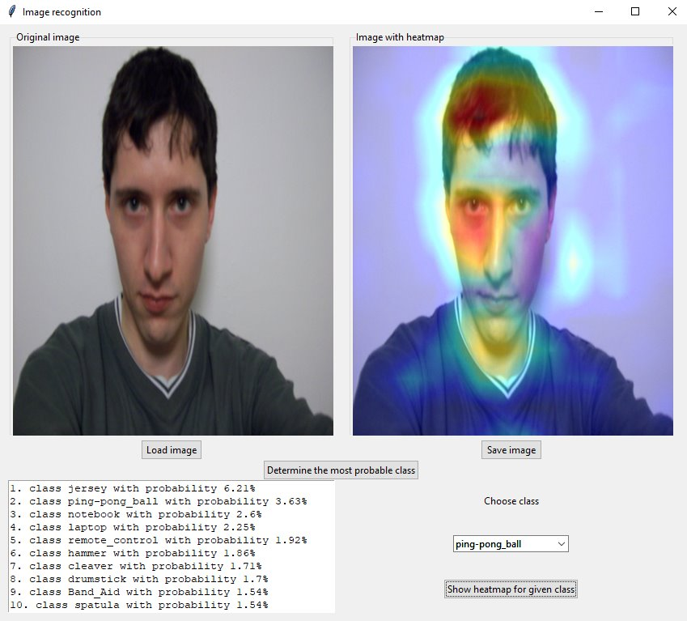

# Goal of the program

Convolutional neural network (CNN) are (under certain coditions) able to determine what object is depicted on a given picture. However, sometimes it could be interesting to know why CNN has its conclusion. The goal of presented program is to show which parts of an original picture has led the CNN to its decision. To be more specific, code responsible for superposition of original image and heatmap of class activation is from book "Deep learning with Python" from F. Chollet (code snippets can be found https://github.com/fchollet/deep-learning-with-python-notebooks/blob/master/5.4-visualizing-what-convnets-learn.ipynb). The presented program enables quick change of image potential classes and compare difference in resulting pictures. From following pictures it can be seen that the predictions aren't ideal, especially for object types which the model hasn't been trained with.  
  
  

# Technical details
Used Python version: 3.7.3  
External packages versions:  
> keras 2.2.4  
> keras-applications 1.0.8  
> keras-preprocessing 1.1.0  
> numpy 1.16.2  
> opencv-contrib-python 4.1.0.25  
> pillow 5.4.1  

# History
14.7.2019 First version  
8.7.2019 Small changes in readme
